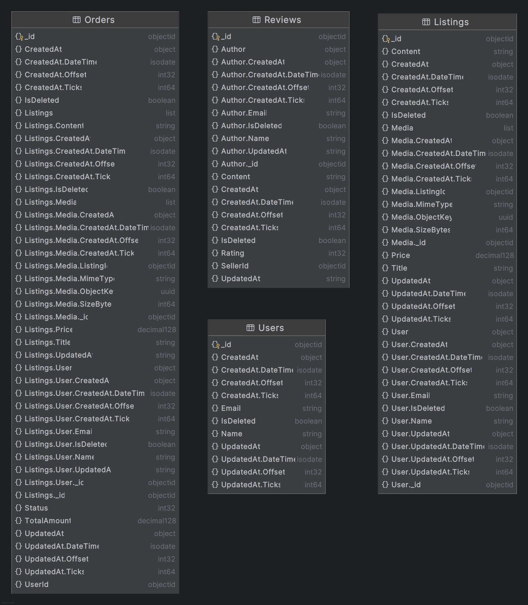
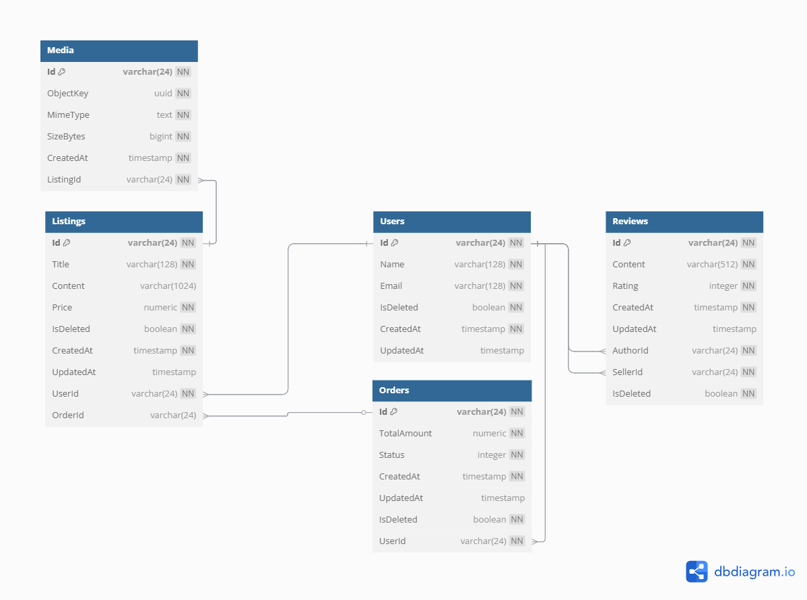

# Compulsory Assignment 2: Databases for Developers

## Requirements
Your assignment must satisfy the following requirements:

1. The implementation must clearly demonstrate contributions from every group member.
2. All design decisions and assumptions must be thoroughly documented in a README.md file.
3. The implementation must be done in a public GitHub repository.

## Scenario
Your team has been hired to design and implement the backend of an e-commerce platform specializing in second-hand items. The platform allows users to

1. List items for sale
2. Browse listings
3. Place orders
4. Review sellers

Key design considerations include:

- **NoSQL Database**: Efficient handling of user-generated listings, flexible schema requirements for varying item types, and rapid scalability.
- **Cloud Storage**: Reliable and scalable storage for item images and multimedia content.
- **Caching**: Improve performance by caching frequently accessed data such as item listings, user profiles, and search results.
- **CQRS** (Command Query Responsibility Segregation): Separate read and write operations to enhance scalability, performance, and maintainability.
- **Transactions**: Ensure consistency and reliability when users perform critical operations like placing an order or updating listings.

## Design & Implementation
You must clearly outline and justify your design choices addressing the following questions:

1. ### Database Selection, Data Shema and Storage Strategy:
   - Identify and justify the selection of databases (relational and NoSQL) for various parts of your application.
   - Define the data models and storage strategies you will use.
   - Clearly document how you will store and manage different kinds of data (listings, user profiles, orders, reviews).

As is a common practice in the CQRS pattern, we have chosen to use two different databases for the read and write sides of the application. 
This allows optimization of each database for its specific purpose, and allows us to use different technologies for each side.



#### Write:
For the write side, we have chosen a traditional relational database, `PostgreSQL`, which allows us to use transactions and ensure data integrity. 
The main benefits of using a relational database for this purpose include:
- Performing data validation and ensuring data integrity through the use of foreign keys and constraints.
  - We can ensure that a listing cannot be created without a valid user, and that a review cannot be created without a valid listing and user.
- Using transactions to ensure that all operations are completed successfully or none at all, which is crucial for maintaining data consistency.
  - For example, when a user places an order, we need to ensure that the order is created, the listings are updated, and cannot be bought by another user.



#### Read:
As for read operations, we went with `MongoDB`, which is a NoSQL database that allows for flexible schema design and rapid scalability.
Since it is a document-based database, it allows quicker retrieval of data, especially when we leverage the denormalization of data.
That is why there are four collections in the database:
```csharp
    public IMongoCollection<ListingReadEntity> Listings { get; }
    public IMongoCollection<OrderReadEntity> Orders { get; }
    public IMongoCollection<UserReadEntity> Users { get; }
    public IMongoCollection<ReviewReadEntity> Reviews { get; }
```

The `Users` collections is, however, not utilized for access to users, but rather just to allow users to exist without having a listing or order, and 
to allow referencing users in the `Review` and `Order` collections. We thought these shouldn't be stored on the `User` collection, but rather have their own collections.

It could be argued that the reviews could be stored in the `User` collection, since they are related to the user, but that probably depends on the use case and how the data is accessed (mainly the UI design).
This would also raise the question, do we store the reviews written **for** the user, or the reviews written **by** the user? There could be arguments for both, and it would depend on the use case.
Rather than that, we have decided to denormalize the data in the `Review` collection, and store the user that wrote the review, as that would enable fetching the whole comment/review in one go.

The `Listings` collection is used to store the listings, and is denormalized to include the user that created the listing, as well as the media (images), so all relevant data can be retrieved in one lookup.
The `Orders` collection is used to store the orders, and is denormalized to include the listings that were ordered. The user is not included, as the user would only be able to see their own orders, 
so if they're logged in, we most likely already have the user data that we need.

3. ### Integration of Cloud Storage:
   - Describe how you will integrate cloud storage for images and other media. 
   - Include a clear explanation of interactions between cloud storage and your databases.

`MinIO` is used as an S3 bucket for storing images, which are uploaded by users. This is because databases are not famous for their performance in storing large binary files. 
Therefore, the database is used to store metadata about the images, and the generated object key, which references the image in the MinIO bucket. 

When the images are retrieved, the application creates a presigned URL for the image, allowing users to access it. The URL is only valid for a limited time, ensuring security and privacy.

On the write side, there is a simple`1:0...*` relationship between [Media](Reclaim/Domain/Entities/Write/MediaWriteEntity.cs) and the [Listing](Reclaim/Domain/Entities/Write/ListingWriteEntity.cs).
In terms of the read side, the media do not have their own collection. Instead, they are stored on the [Listing](Reclaim/Domain/Entities/Read/ListingReadEntity.cs) for quick retrieval.

4. ### Caching Strategy:
   - Define your caching approach, including technologies used, cache invalidation strategy, and which data will be cached.

`Redis` is used as a caching solution. The cache is used to store frequently accessed data, such as item listings, and orders. 
We tried to map out the data that would most likely be accessed frequently (e.g., a user's listings) and store that in the cache for quick retrieval.

Since both the MongoDb and Redis repositories are implemented using the [IListingReadRepository](Reclaim/Infrastructure/Repositories/Read/Interfaces/IListingReadRepository.cs), we are using a decorator pattern to register both repositories.
This enables the service to only have `IListingReadRepository` as a dependency (and in this case the [Redis repository](Reclaim/Infrastructure/Repositories/Read/Implementations/Redis/ListingReadRedisRepository.cs) is actually injected), as the Redis repository wraps the MongoDb repository. 
We also don't run into issues with the dependency injection container, as we are not trying to register the same interface twice. 

There could be arguments made for not letting the infrastructure layer not be responsible for deciding which repository to contact for the data, as it could be seen as a business decision.
However, we believe that this is a good approach, as it abstracts away the data access layer completely from the application layer, and allows us to easily switch out the implementation if needed.

Registration of the repositories:
```csharp
services.AddScoped<ListingReadMongoRepository>();
services.AddScoped<IListingReadRepository>(provider =>
{
   var mongoRepository = provider.GetService<ListingReadMongoRepository>()
                         ?? throw new ArgumentNullException(nameof(ListingReadMongoRepository),
                             "Mongo repository is null");

   var redisContext = provider.GetService<RedisContext>()
                      ?? throw new ArgumentNullException(nameof(RedisContext), "Redis context is null");

   return new ListingReadRedisRepository(redisContext, TimeSpan.FromSeconds(30), mongoRepository);
});
```

Example of how the Redis repository is used to cache the data, or delegate to the MongoDb repository if the data is not in the cache:
```csharp
public async Task<ListingReadEntity?> GetByIdAsync(string id, bool includeDeleted = false)
{
  var cachedListing = await Db.StringGetAsync(id);
  if (cachedListing.IsNullOrEmpty)
  {
      var result = await persistentRepository.GetByIdAsync(id, includeDeleted);
      if (result == null)
      {
          return null;
      }
      
      await IndexAsync(result);
      return result;
  }
  
  return JsonSerializer.Deserialize<ListingReadEntity>(cachedListing!, JsonSerializerOptions);
}
```

The cache is invalidated through the use of domain events and corresponding handlers, like the [listing event handler](Reclaim/Infrastructure/EventBus/Listing/ListingEventsHandler.cs) 
that is responsible for listening to events published by the [ListingWriteService](Reclaim/Application/Services/Implementations/ListingService.cs) and invalidating the cache when a listing is modified.

5. ### CQRS Implementation:
   - Explain your approach to separating read and write operations, if applicable. 
   - Clarify how this impacts the application's scalability and complexity.
   
6. ### Transaction Management:
   - Detail your approach to ensuring transactional integrity, particularly in scenarios such as orders and listing updates.

Unit of work pattern
Different isolation levels